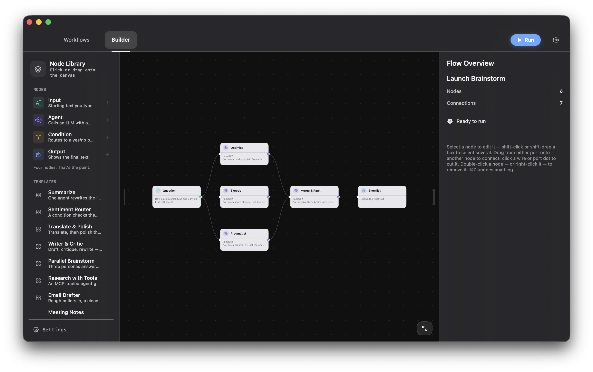
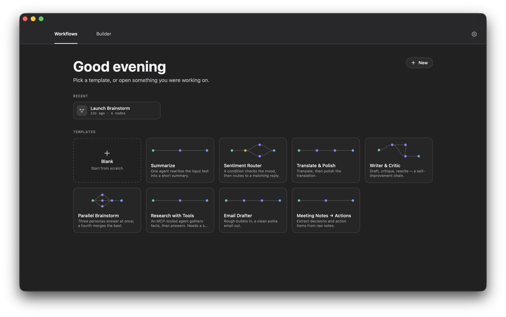

# Osler

Design AI agent workflows on a canvas, on your Mac. Drop nodes, wire them into
a flow, hit Run — the graph executes and every node's output streams in live.

No Docker, no web stack, no account, no subscription, no telemetry. Everything
runs on your machine and everything stays there. With [Ollama](https://ollama.com)
it runs without an API key at all.



## Four node types

That's the point. The whole vocabulary is:

- **Input** — the starting text.
- **Agent** — a system prompt and a model. Takes the incoming text, calls the
  LLM, streams text out. Can call MCP tools.
- **Condition** — routes to a `yes` or `no` branch, either by keyword or by
  asking a model a yes/no question.
- **Output** — shows the final text.

Branches that don't depend on each other run **concurrently**, several inputs
can fan into one node (they're joined in edge order), and the branch a
condition didn't take is marked skipped rather than silently dropped.

## Why so few nodes?

Because the vocabulary is small, not the ceiling. An Agent reaches anything
through MCP tools, `{{Node name}}` reaches any value upstream, and iteration is
coming as a node that loops inside itself rather than a cycle on the canvas.

Hosted builders solve a different problem — they're infrastructure for
companies shipping products, with evals, tracing and one-click deployment, and
they run that vendor's models. Osler is a Mac app for one person's work. It can
run Claude, GPT and a local model in the same flow, offline if you want, with
no account to make.

## Reaching sideways

Text flows along the wires, but a node can also reach a value that isn't wired
into it. Write `{{Node name}}` in an Agent's system prompt (or a Condition's
question) and it's replaced at run time with that node's output:

```
Compare the two.
Original: {{Text}}
Translation: {{Translate}}
```

References may only point *upstream* — at a node that's guaranteed to have
finished first. Anything else is flagged before the flow runs, so a value can
never race its reader. The inspector lists what's in reach.

## Tools, via MCP

An Agent can call tools from [MCP](https://modelcontextprotocol.io) servers —
files, web, APIs, anything with a server. Add one in **Settings → MCP** as a
local command:

```
npx -y @modelcontextprotocol/server-filesystem ~/Documents
```

Hit **Test** to launch it and see its tools, then enable the server on any
Agent node. The agent decides when to call what; each call shows up in the
node's output as it happens.

Today Osler speaks to stdio servers only, and a tool-enabled agent answers turn
by turn instead of streaming live. Tool calls run without an approval step —
an Approval node is next on the [roadmap](ROADMAP.md).

## Models

Bring your own key, or bring your own machine:

| Provider | Needs a key | Notes |
| --- | --- | --- |
| Anthropic | yes | Messages API, streaming |
| OpenAI | yes | Chat Completions, streaming |
| Ollama | **no** | Local models, fully offline |

Keys live in the macOS **Keychain** — never on disk in plain text, never sent
anywhere except the provider you're calling. Ollama needs nothing but a running
server at `localhost:11434`.

## Getting started

Requirements: macOS 14+ and Swift 5.9+ (Xcode 15+).

```sh
git clone https://github.com/albertofettucini/Osler.git
cd Osler
swift run Osler
```

Or build a real, double-clickable app:

```sh
./scripts/package-app.sh --desktop     # builds Osler.app and copies it to ~/Desktop
```

The bundle is ad-hoc signed (no Apple Developer account behind it), so the
first launch needs **right-click → Open** once. macOS remembers after that.

Other targets:

```sh
swift test                          # engine tests
swift run osler-cli --demo linear   # headless run (uses Ollama when no key is set)
swift run osler-cli --demo tools    # MCP tool loop against a mock server
swift run osler-cli --demo cycle    # cycle detection, no model needed
```

## Around the canvas

Eight starter templates ship with the app — Summarize, Sentiment Router,
Translate & Polish, Writer & Critic, Parallel Brainstorm, Research with Tools,
Email Drafter, Meeting Notes → Actions. Open one, press Run, take it apart.



Wiring is two-way: drag from either port onto another node to connect, click a
wire (or a port dot) to cut it. Double-click empty canvas to add a node where
you clicked, or drag one in from the library. Shift-click and shift-drag select
several nodes; ⌘Z undoes anything. ⌘K opens a command palette. Save any flow as
a template and it joins the library.

Flows are plain JSON files (`.oslerflow`) — readable, diffable, and yours. A
flow saved by a newer version keeps its unknown nodes intact when an older
build opens it.

Appearance follows the system, or you can pin light/dark and pick a background
wash and card tint in Settings.

## Architecture

**`OslerEngine`** is a headless Swift library with no UI dependency:

- `FlowGraph` / `Node` / `Edge` — the Codable graph model.
- `GraphValidator` — structural checks and topological ordering, with real
  cycle errors instead of hangs.
- `FlowEngine` — readiness-based scheduling (independent branches run in
  parallel), per-node state as an async event stream, cancellation throughout.
- `LLMProvider` — a two-method protocol: stream text, or take one tool-calling
  turn. Adding a provider is a single type.
- `MCPClient` / `MCPToolbox` — stdio JSON-RPC, tool discovery, call routing.

**`Osler`** is the SwiftUI app — canvas, inspector, run controller — bound to
the engine's event stream. **`osler-cli`** runs flows headlessly.

64 tests cover the engine, including a real subprocess round-trip against a
scripted MCP server.

## License

MIT — see [LICENSE](LICENSE).
